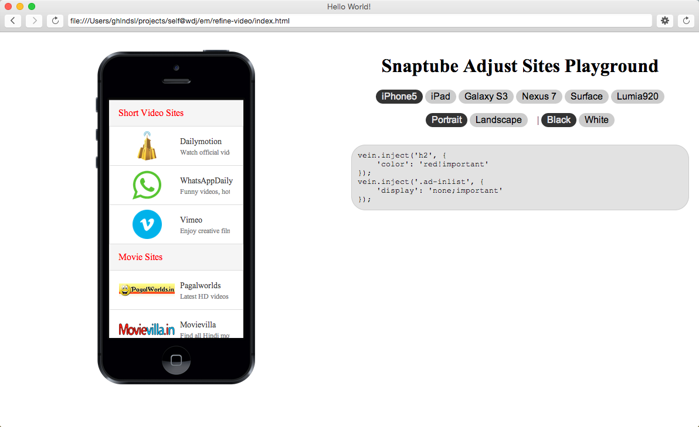

## Intro
nw.js project which used to purify websites(inject css/js etc)

```
webpack --progress --colors --watch -p entry.js bundle.js
cp bundle.js ~/Downloads/WebViewInjectionDemo/app/src/main/assets/min.js

when debug, using tampermonkey
(function() {
    var s = document.createElement('script');
    var h = document.getElementsByTagName('head')[0];
    s.src = 'http://localhost:8080/bundle.js';
    s.async = 1;
    h.parentNode.insertBefore(s, h);
})();
```

## Screenshots

